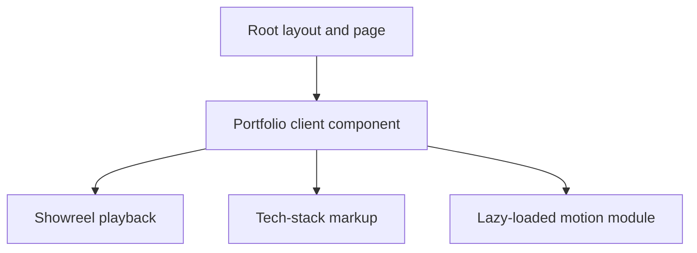

# Portfolio architecture

This document explains how Sandhit Karmakar's portfolio is organized, how its animations work, and how the same application is built for Sites or Vercel. For installation and deployment commands, read [README_SETUP_DEPLOYMENT.md](README_SETUP_DEPLOYMENT.md).

## 1. Application overview

The portfolio is one page at `/`, with anchor navigation between sections. Its content includes the hero, expanding project reel, about, selected projects, experience, approach, technology stack, and contact footer.

It uses React 19, TypeScript, App Router conventions, GSAP with ScrollTrigger, Lenis, and custom CSS. Content is defined in source files. There are no portfolio API routes, authentication flows, databases, CMS connections, or required environment variables. Some unused starter dependencies remain in the manifest; their presence does not mean the portfolio uses those services.

There are two build targets sharing the same application:

| Target                       | Entry command     | Build output                           | Hosting                    |
| ---------------------------- | ----------------- | -------------------------------------- | -------------------------- |
| Existing Sites application   | `pnpm build`      | Worker and client assets under `dist/` | Current Sites deployment   |
| Standard Next.js application | `pnpm build:next` | `.next/`                               | Vercel or a Node.js server |

The Sites target uses Vinext/Vite and Cloudflare tooling. The Vercel target invokes the installed Next.js CLI directly. Neither target requires duplicating application code. `vercel.json` selects Next.js and the correct build command explicitly.

## 2. Components and boundaries



| File                 | Responsibility                                                                                                   |
| -------------------- | ---------------------------------------------------------------------------------------------------------------- |
| `app/layout.tsx`     | Root document, global stylesheet, metadata and Memoji favicon links                                              |
| `app/page.tsx`       | Route entry point that renders the portfolio                                                                     |
| `app/portfolio.tsx`  | Page composition, project/skill data, social links, active navigation, copy-email feedback and motion preference |
| `app/showreel.tsx`   | Video element, poster and playback lifecycle                                                                     |
| `app/tech-stack.tsx` | Technology list, logo grid and duplicated letter markup                                                          |
| `app/motion.ts`      | GSAP timelines, ScrollTrigger, Lenis, pointer effects and cleanup                                                |
| `app/globals.css`    | Design tokens, responsive layout, self-hosted fonts, focus states and CSS hover effects                          |
| `public/`            | Video, poster, Memoji, favicons, fonts and technology icons                                                      |

`Portfolio` is a client component because it uses state, event handlers and browser APIs. Its initial markup can still be rendered before hydration. `TechStack` has no independent state, but it is part of the client component tree. GSAP is dynamically imported after the browser's motion preference is known.

## 3. State and interaction flow

- **Active navigation:** an IntersectionObserver watches the elements marked `data-nav-section` and updates the dock's active link.
- **Motion preference:** the browser's `prefers-reduced-motion` setting and the saved `sandhit-motion` localStorage preference determine whether motion starts. This is a preference on the visitor's device, not a server-side setting.
- **Copy email:** the Clipboard API copies the email address and briefly shows confirmation. If copying fails, the page opens a `mailto:` link.
- **Contact:** “Get in touch” opens an email application. Its thumbs-up and rolling label use CSS transitions for hover and keyboard focus. No email is sent by the site itself.
- **Projects:** links open the existing project or repository. The interface visuals and reel are labelled concepts rather than screenshots of live product data.

## 4. Animation architecture

`setupMotion(root)` creates a scoped GSAP context and returns a cleanup function. Lenis advances from GSAP's ticker; Lenis scroll events notify ScrollTrigger. Native CSS smooth scrolling is temporarily disabled while Lenis owns scrolling.

The returned cleanup removes the ticker, destroys Lenis, reverts GSAP/ScrollTrigger contexts and media queries, removes listeners, and restores the previous scroll behavior. This supports React remounts and the dock's pause/resume control without accumulating duplicate timelines.

### Expanding hero video

The `expanding-showreel` timeline briefly pins `.hero-scene`. The reel grows from 18% scale to full width while its offset and rotation settle, and the hero text recedes. Scrolling upward reverses the same timeline. When animations are disabled, the reel returns to normal document flow.

The video is muted, loops, and plays inline. An IntersectionObserver and `visibilitychange` listener pause it when offscreen or in a hidden tab. A local poster is available before playback and when autoplay is blocked. The dock pause control also pauses playback.

### Slower technology lettering

Each `.stack-letter` contains two identical glyphs. One occupies the normal line and another sits directly above it. A clipped `.stack-line` hides overflow. Moving the pair down by 100% makes the original letter leave at the bottom while the copy enters from above.

Current ScrollTrigger settings in `app/motion.ts`:

```ts
start: "top 78%",
end: "center 20%",
scrub: 1.05,
invalidateOnRefresh: true,
```

The animation starts when the stage's top reaches 78% of the viewport height and ends when its center reaches 20%. This increases travel compared with the earlier `center 45%` endpoint. `scrub: 1.05` gives the animation approximately one second to catch up to the current scroll position.

To slow it further, lower the percentage in `end`, which lengthens the scroll interval. A larger `scrub` adds smoothing/lag; it does not by itself lengthen that interval. The tween's `duration` and `stagger` control each letter's share of the scrubbed sequence, rather than fixed playback time independent of scrolling. Keep the explicit `stackOrder` aligned with the 15 letters if the heading text changes.

### Other motion

Masked hero entrances, section reveals, project-card transforms, reading progress and the toolkit marquee live in the motion module. Magnetic pointer effects and sculpture floating apply to desktop fine-pointer layouts. Technology-tile and contact-button hover transitions live in CSS.

## 5. Assets, styling and accessibility

Colors, fonts and spacing originate in CSS variables such as `--paper`, `--ink`, `--lime`, `--sans` and `--display`. The layout adapts around the 700px breakpoint; the technology grid becomes two columns on small screens.

Inter and Space Grotesk are self-hosted. Technology logos are local SVGs, with licenses and attribution under `public/icons/`. Memoji favicon PNG/ICO files and the Apple touch icon are declared in the layout. The generic generated avatar can be replaced without changing navigation behavior.

The page includes semantic headings, a skip link, focus styles and accessible control names. Duplicate animated glyphs are hidden from assistive technology; the tech heading has a single readable accessible label. The full heading remains readable with motion disabled. Static content remains available if the animation module cannot load.

## 6. Build and configuration files

| File or directory                                       | Purpose                                                            |
| ------------------------------------------------------- | ------------------------------------------------------------------ |
| `package.json` / `pnpm-lock.yaml`                       | Declared dependencies, pinned dependency graph and commands        |
| `next.config.ts`                                        | Standard Next.js configuration                                     |
| `postcss.config.mjs`                                    | Tailwind's PostCSS integration, used by Next.js as well            |
| `vercel.json`                                           | Vercel framework, installation and build command selection         |
| `vite.config.ts`, `build/`, `scripts/run-framework.mjs` | Existing Sites/Vinext integration                                  |
| `.openai/hosting.json`                                  | Identity and logical bindings for the existing Site                |
| `.sites-runtime/`                                       | Ignored local runtime state; not distributed as application source |
| `vendor/`                                               | CSS imported by the global stylesheet; retain it in deployments    |

Keep the Sites manifest and build scripts when maintaining the current hosted Site. Vercel uses the Next.js path and does not need Sites repository credentials or Cloudflare credentials.

## 7. Safe places to customize

Change personal and project content in `portfolio.tsx`, technologies in `tech-stack.tsx`, motion in `motion.ts`, and appearance in `globals.css`. Replace media under `public/` while keeping filenames or updating their component references. Metadata and favicon paths belong in `layout.tsx`.

If a backend or contact form is added later, it will need its own implementation and deployment configuration. The current project has no API key or database requirement.

## References

- [Next.js installation and scripts](https://nextjs.org/docs/app/getting-started/installation)
- [GSAP ScrollTrigger](https://gsap.com/docs/v3/Plugins/ScrollTrigger/)
- [Lenis integration](https://github.com/darkroomengineering/lenis#gsap-scrolltrigger)
- [Next.js on Vercel](https://vercel.com/docs/frameworks/full-stack/nextjs)
